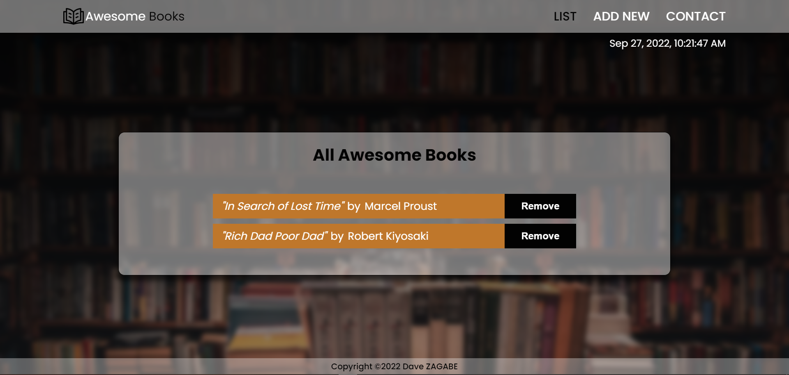

# Awesome Books

> This project is a simple personnal library that allows the user to store all his favorite books or the ones to be read in his browser's local storage. Therefore we use the javscript method localStorage to store the user's data. At this stage it supports insertion and deletion but in the future more features might be added.

## Built With

- HTML
- CSS
- Javascript
- node.js (npm)
- luxon

## Live Demo (if available)

[**See Project 🚀**]()

## Screenshot



## Getting Started

To get a local copy up and running follow these simple example steps.

### Prerequisites

To understand the project you must have a basic knowledge about HTML, CSS and Javascript.

### Setup

To run this project one must have Visual Studio (VS) Code installed and running.

### Usage

Clone and access the repository using the following commands on Git Bash:

  ```
   cd PATH 
   git clone _https://github.com/DaveZag/Awesome_books_ES6.git_
   cd _Awesome_books_ES6_
  _index.html_ 
  ```

Open the directory in visual studio code by typing the following command in Git Bash:

 ```
 code .
  ```
Then using the live server of VS Code you can view the page.

## 👤Author

- GitHub: [@Dave Zag](https://github.com/DaveZag)
- Twitter: [@Dave Zagabe](https://twitter.com/davezagabe2)
- LinkedIn: [@Dave Zagabe](https://www.linkedin.com/in/dave-zagabe-03597a247/)

## 🤝 Contributing

Contributions, issues, and feature requests are welcome!

Feel free to check the [issues page](../../issues/).

## Show your support

Give a ⭐️ if you like this project!

## Acknowledgments

- Pexels for the free access to high quality images.

## 📝 License

This project is [MIT](./LICENSE) licensed.
